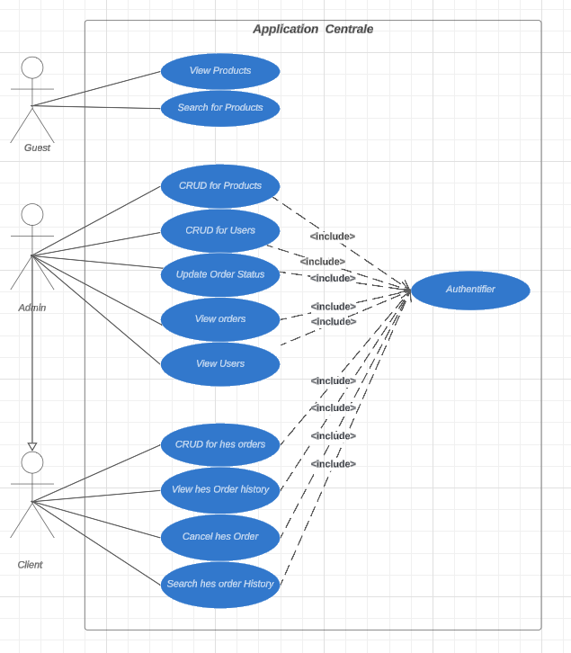
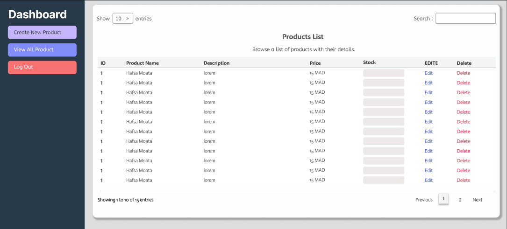

# Projet de Gestion des Commandes en Ligne

## Description du projet

Ce projet consiste en une application web sécurisée permettant la gestion des commandes en ligne. Elle offre des fonctionnalités différenciées pour les clients et les administrateurs, incluant la gestion des utilisateurs, des produits et des commandes.

### Objectif général de l'application

L'objectif principal est de fournir une plateforme robuste et sécurisée permettant :
- Aux clients de passer et gérer leurs commandes
- Aux administrateurs de gérer les utilisateurs, les produits et les commandes

## Technologies utilisées

- Java 8
- Maven pour la gestion des dépendances
- Thymeleaf comme moteur de template
- JPA et Hibernate pour la persistance des données
- PostgreSQL comme système de gestion de base de données
- JUnit et Mockito pour les tests unitaires
- Tomcat comme serveur d'application
- Git pour le contrôle de version
- JIRA pour la gestion de projet (méthode Scrum)

## Fonctionnalités principales

1. **Authentification et gestion des utilisateurs**
    - Connexion sécurisée avec différents rôles (Admin, Client)
    - Gestion des profils utilisateurs

2. **Gestion des produits** (Admin)
    - CRUD des produits
    - Gestion des stocks

3. **Gestion des commandes**
    - Pour les clients :
        - Passage de nouvelles commandes
        - Modification/annulation des commandes en attente ou en traitement
        - Visualisation de l'historique des commandes
    - Pour les admins :
        - Visualisation de toutes les commandes
        - Mise à jour du statut des commandes

4. **Interface utilisateur responsive**
    - Utilisation de Thymeleaf pour des vues dynamiques
    - Design moderne et adaptatif

## Bonnes pratiques de développement

- **TDD (Test-Driven Development)** : Développement guidé par les tests
- **Clean Code** : Application des principes de code propre et lisible
- **Design Patterns** : Utilisation de patterns comme Repository et Singleton
- **Gestion de version** : Utilisation de Git avec des branches (Git Flow)
- **Intégration continue** : Configuration de pipelines CI/CD (à implémenter)
- **Logging** : Mise en place d'un système de logging pour faciliter le débogage
- **Sécurité** : Hachage des mots de passe, validation des entrées utilisateur

## Structure du projet

Le projet suit une architecture MVC (Modèle-Vue-Contrôleur) en couches :
- Présentation (Thymeleaf)
- Contrôleurs
- Services
- DAO (Data Access Object)
- Repositories
- Modèles (entités JPA)
- Utilitaires

## Description brève de l'architecture adoptée

L'application utilise une architecture en couches avec :
- Servlets comme points d'entrée (contrôleurs)
- Services pour la logique métier
- Repositories pour l'accès aux données
- Thymeleaf pour le rendu des vues
- Implémentation des design patterns Repository et Singleton

## Instructions d'installation et d'utilisation

### Prérequis

- JDK 8
- Maven
- PostgreSQL
- Tomcat 9

### Étapes pour configurer la base de données

1. Créez une base de données PostgreSQL nommée `centrale_db`
2. Exécutez le script SQL fourni dans `src/main/resources/db.sql`

### Comment lancer l'application sur Tomcat

1. Clonez le repository : `git clone https://github.com/Hafsa-Naoufal-Wail/Hafsa_Naoufal_Wail_Sprint_2_B3_Centrale.git`
2. Compilez le projet : `mvn clean package`
3. Déployez le fichier WAR généré sur Tomcat

## Captures d'écran
**Diagramme de Classes UML**

Diagramme de classes UML représentant la structure du système, incluant les entités principales comme les utilisateurs, produits,
commandes et leurs relations. Ce modèle sert à définir les propriétés et les méthodes associées à chaque classe.

**Diagramme d'Utilisation UML**

Diagramme des cas d'utilisation illustrant les interactions possibles entre les différents acteurs (utilisateurs et administrateurs) et le système. 
Chaque cas d'utilisation détaille une fonctionnalité principale du système.

**Jira**

Capture d'écran de l'outil Jira utilisé pour la gestion des tâches du projet. Chaque tâche est catégorisée et suivie avec des statuts comme 'À faire', 'En cours', et 'Terminé'.

**Figma - Design des produits**

Prototype d'interface utilisateur développé avec Figma, affichant la page des produits. Cette maquette permet de visualiser l'agencement et l'interaction avec les éléments du produit.

**Figma - Tableau de bord (Dashboard) - Sous Admin**

Aperçu du tableau de bord admin conçu dans Figma, les options de gestion pour l'administrateur, comme la gestion des produits.

**Figma - Tableau de bord (Dashboard) - Super Admin**

Vue détaillée du tableau de bord,des indicateurs de performance pour suivre l'état du système en temps réel. Ce design met en évidence les options de navigation pour une meilleure gestion des ressources.

## Améliorations futures possibles

- Intégration d'un système de paiement en ligne
- Implémentation d'un système de notifications par email
- Ajout d'un tableau de bord pour les analyses de ventes
- Optimisation des performances avec du cache

## Auteur et contact

- Wail BOUKHARI 
- Hafsa ELMOATASSIM BILLAH 
- Naoufal LEBRIHMI
